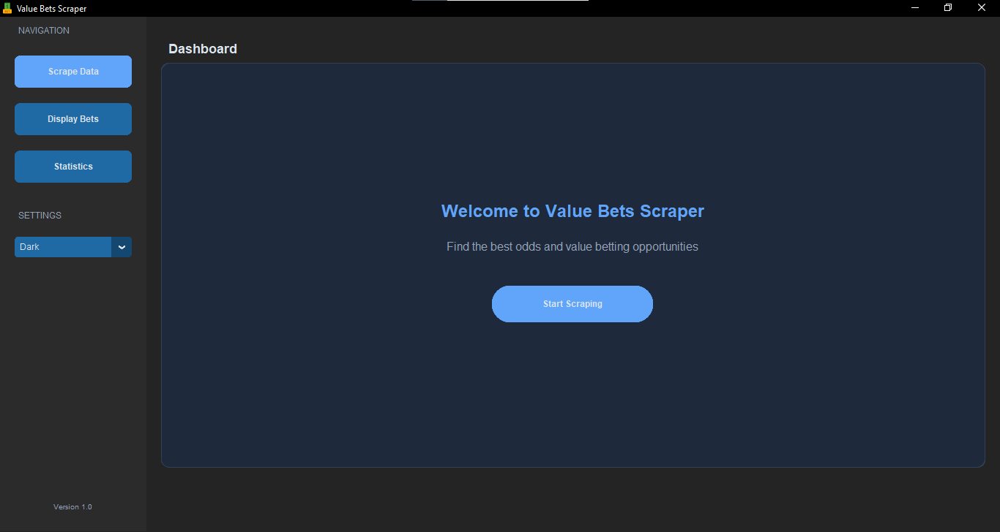
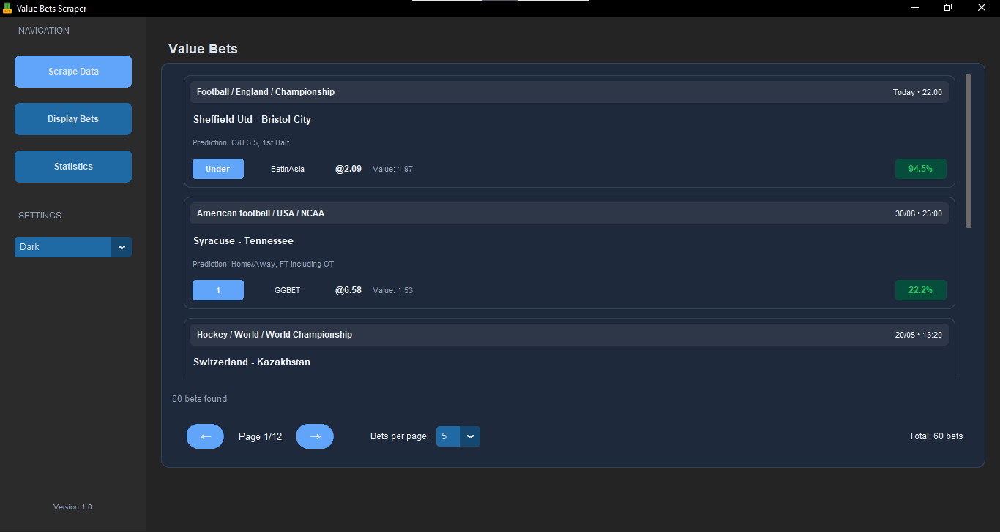
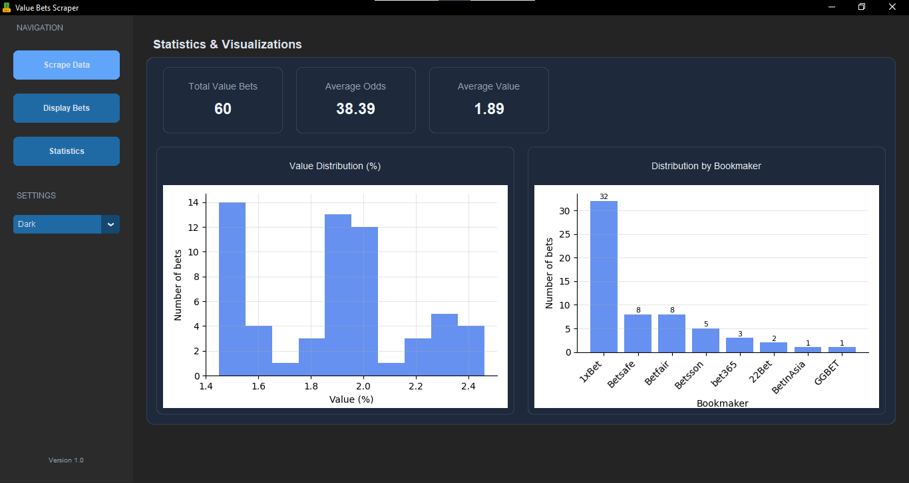

# ValueBetScraper - Value Betting Detector

ValueBetScraper is a modern tool that scrapes value bets from bookmaker websites and helps you identify the best sports betting opportunities.

<div align="center">
  
  <p><em>Page d'accueil de l'application</em></p>
  
  
  <p><em>Affichage des paris à valeur trouvés</em></p>
  
  
  <p><em>Visualisations et statistiques</em></p>
</div>

## 🌟 Features

- Automated value bet scraping from OddsPortal
- Modern user interface with CustomTkinter
- Interactive data visualization with charts
- Light/dark themes for a customized user experience
- System notifications for high-value bets found
- Smart pagination to display large datasets
- Comprehensive logging for debugging and tracking

## 📋 Requirements

- Python 3.8 or higher
- Python libraries listed in `requirements.txt`

## 🚀 Installation

1. Clone this repository:
    ```bash
    https://github.com/AinaRazafinjato/value-bets-scraper.git
    cd value-bets-scraper
    ```

2. Install dependencies:
    ```bash
    pip install -r requirements.txt
    ```

3. Install Playwright:
    ```bash
    playwright install chromium
    ```

## 🏃‍♂️ Usage

To launch the application:
```bash
python -m src.gui.app
```

### Scraping Value Bets

1. Launch the application
2. Click "Start Scraping" in the interface or use the dedicated button in the side menu
3. Wait for the process to complete - a progress bar and animation will keep you informed
4. Results will display automatically once finished

### Data Visualization

- Use the "Statistics" tab in the sidebar to view visualizations
- Examine the value distribution and bookmaker breakdown
- Check key indicators like average value and average odds

## 🧩 Project Structure

```
vbscraper/

├── assets/          # Graphic resources (icons, images)
├── data/            # Scraped data (CSV)
├── logs/            # Log files
├── src/                 # Source code
│   ├── config/          # Configuration
│   ├── gui/             # User interface
│   ├── scraper/         # Scraping module
│   └── main.py          # Main entry point
├── .env                 # Environment variables template
├── .gitignore           # Files ignored by Git
├── README.md            # Documentation
└── requirements.txt     # Dependencies
```

## 🧪 Simulation vs Real Mode

- If the scraping module is not available, the application will run in simulation mode
- Simulation mode generates synthetic data to test the interface
- For real scraping, ensure Playwright and BeautifulSoup libraries are properly installed

## 🔧 Configuration

Modify variables in `.env` to enter your configuration details.
Add your OddsPortal username and password, as well as other scraping parameters.

```env
# Authentication settings
ODDPORTAL_USERNAME=your_username
ODDPORTAL_PASSWORD=your_password
```

## 📊 Visualization Examples

The application generates two main types of visualizations:

- **Value distribution**: histogram showing the distribution of value percentages
- **Bookmaker breakdown**: bar chart showing bets by bookmaker

## ⚠️ Known Limitations

- Scraping may be detected by some sites and temporarily blocked
- Statistics are based solely on data available in the CSV file
- Scraping speed depends on internet connection and target site responsiveness

## 🤝 Contribution

Contributions are welcome! Feel free to:

1. Fork the project
2. Create a feature branch (`git checkout -b feature/amazing-feature`)
3. Commit your changes (`git commit -m 'Add amazing feature'`)
4. Push to the branch (`git push origin feature/amazing-feature`)
5. Open a Pull Request

## 📝 License

This project is licensed under MIT - see the LICENSE file for details.

## 🙏 Acknowledgements

- CustomTkinter for the modern GUI
- Playwright for browser automation
- Matplotlib for data visualizations
- pandas for data manipulation

> **Warning**: This project is provided for educational purposes only. Using this software for scraping must comply with the terms of use of the sites concerned. Sports betting involves financial risks.